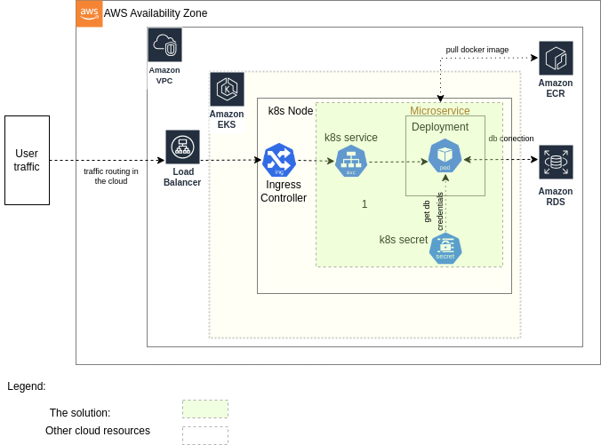

# Hello World App - A sample statefull app

This document provides instructions for setting up and running the Hello World App in both local and cloud Kubernetes environments.

## Table of Contents

- [Prerequisites](#prerequisites)
- [Architecture](#architecture)
- [Building and Pushing Docker Images](#building-and-pushing-docker-images)
- [Kubernetes Deployment](#kubernetes-deployment)
  - [Local Kubernetes Deployment](#local-kubernetes-deployment)
  - [Cloud Kubernetes Deployment (AWS)](#cloud-kubernetes-deployment-aws)


## Prerequisites

Before you begin, ensure you have the following installed on your local machine:

- [Python](https://www.python.org/downloads/)
- [Docker](https://www.docker.com/products/docker-desktop)
- [Kind](https://kind.sigs.k8s.io/docs/user/quick-start/)
- [Helm](https://helm.sh/docs/intro/install/)

## Architecture

The architecture includes the app solution running in EKS cluster and relevant cloud resources



## Building and Pushing Docker Images
2. **Build and Push Docker Image:**

   ```sh
   ./scripts/build-and-push.sh
   ```


## Kubernetes Deployment prerequisites

1. **Set Environment Variables:**

   ```sh
   export POSTGRES_USER=your_db_user
   export POSTGRES_PASSWORD=your_db_password
   ```


2. **Create Kubernetes Secrets:**

   ```sh
   ./scripts/create-secret.sh
   ```

## Local Kubernetes Deployment
1. **Deploy PostgreSQL:**

   ```sh
   helm install postgres bitnami/postgresql -f environments/local/values.yaml

   ```
2. **Deploy the Application:**

   ```sh
   helm upgrade --install helloworld-app ./charts/helloworld-app -f environments/local/values.yaml --set postgresql.username=$POSTGRES_USER --set postgresql.password=$POSTGRES_PASSWORD

   ```

## Cloud Kubernetes Deployment (AWS)
1. **Configure and Deploy PostgreSQL on AWS RDS:**
- Create an RDS instance for PostgreSQL in AWS.
- Set up the necessary security groups and VPC settings to allow access from your EKS cluster.
2. **Deploy the Application:**

   ```sh
   helm upgrade --install helloworld-app ./charts/helloworld-app -f environments/aws/values.yaml --set postgresql.username=$POSTGRES_USER --set postgresql.password=$POSTGRES_PASSWORD

   ```

